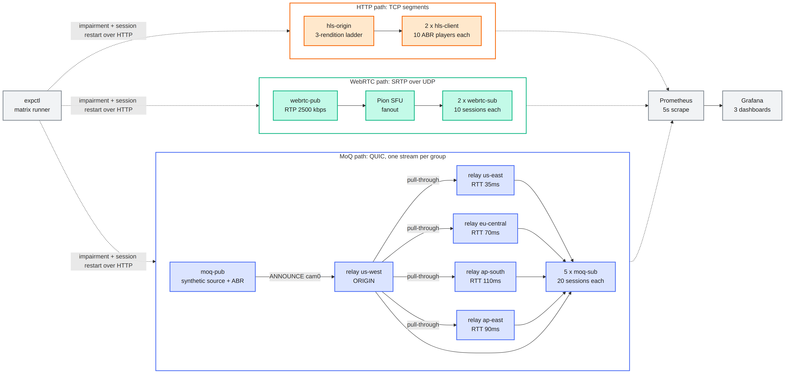
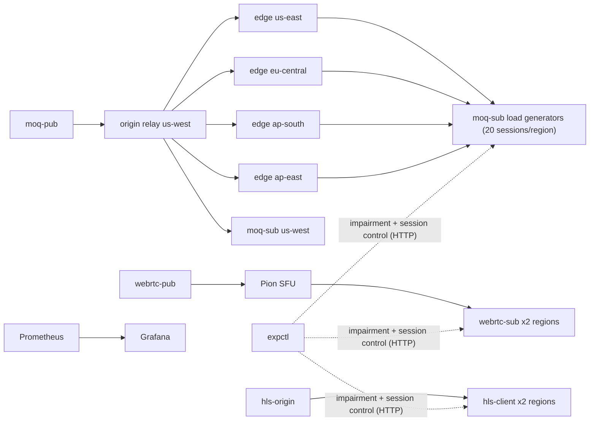

# EdgeCast

A reproducible, single-command testbed that puts three realtime media delivery models on the same footing and measures them under controlled network impairment:

- **Media over QUIC (MoQ-style)**: a 5-region relay tree in Go over quic-go, with stream-per-group delivery, late-join group caching, pull-through edges, and backpressure-driven publisher ABR
- **WebRTC**: a Pion v4 SFU with HTTP signaling and RTP fanout
- **HTTP adaptive streaming (HLS-style)**: a live sliding-window origin and ABR player simulations

Everything is one Go binary, one Docker image, 21 containers, with Prometheus scraping every component and Grafana dashboards provisioned from the repo. An experiment controller runs a scenario matrix (protocol x network profile x repetition), restarts sessions per run, and emits CSV/markdown summaries with per-second session timelines.

## Quickstart

```bash
docker compose up -d --build
```

- Grafana dashboards: http://localhost:3000 (EdgeCast folder: Protocol Comparison, MoQ Relay Deep Dive, Experiments and Network Conditions)
- Prometheus: http://localhost:9090

Run the experiment matrix:

```bash
docker compose run --rm expctl
```

Results land in `results/summary.md`, `results/summary.csv`, and `results/raw/`. The full 120-run matrix: `docker compose run --rm -e MATRIX=/app/scenarios/full.yaml expctl`.

## Architecture





Network impairment is a **userspace link emulator** (an impairing `net.PacketConn` under QUIC and WebRTC's ICE mux, a modeled TCP wrapper under HLS), because Docker Desktop's WSL2 kernel does not ship `sch_netem`. The pivot is documented in [docs/02-architecture.md](docs/02-architecture.md) and made the testbed portable to any Docker host with no privileged containers.

## Sample measured results

From the committed 24-run smoke matrix (4 profiles x 3 protocols x 2 reps, 280 sessions per full pass, zero session errors):

| Profile | Protocol | Startup p50 (ms) | E2E p50 (ms) | Throughput (kbps) | Stalled % |
| --- | --- | --- | --- | --- | --- |
| baseline | moq | **235** | 44 | 4736 | 4.5 |
| baseline | webrtc | 699 | **23** | 2410 | 3.0 |
| baseline | hls | 1218 | 713 | 6000* | **0.0** |
| mobile-4g | moq | 1007 | 6935 | 557 | 47.8 |
| mobile-4g | webrtc | 1182 | **56** | 2594 | **2.9** |
| mobile-4g | hls | 2682 | 1296 | 1200 | **0.0** |

\* download rate during buffer fill, not playback bitrate.

Three headline findings: startup ordering (MoQ < WebRTC < HLS) is structural and held in every profile; after 5%-loss bursts, recovery ordering was WebRTC (~0s, NACK absorbs) < MoQ (~3s) < HLS (~5s); and the MoQ mobile-profile collapse is a deliberate architecture lesson: publisher-side ABR cannot see subscriber access links, which is exactly why real MoQ systems put rate adaptation at the subscriber edge ([docs/06-findings.md](docs/06-findings.md), section 6.3).

Absolute numbers are functions of this emulator and hardware; the point is the controlled comparison. See [docs/05-results.md](docs/05-results.md) for the full table and [docs/08-prototype-vs-production.md](docs/08-prototype-vs-production.md) for what does and does not transfer to production.

## Documentation

| Doc | Contents |
| --- | --- |
| [01-objectives.md](docs/01-objectives.md) | Motivation, research questions, success criteria |
| [02-architecture.md](docs/02-architecture.md) | Components, wire protocol, relay design, emulator, diagrams |
| [03-experiment-design.md](docs/03-experiment-design.md) | Metric definitions, network profiles, run protocol, validity |
| [04-setup.md](docs/04-setup.md) | Prerequisites, operations, knobs, troubleshooting |
| [05-results.md](docs/05-results.md) | Measured smoke-matrix results |
| [06-findings.md](docs/06-findings.md) | Interpretation against the research questions |
| [07-lessons-learned.md](docs/07-lessons-learned.md) | Engineering lessons |
| [08-prototype-vs-production.md](docs/08-prototype-vs-production.md) | External validity, honestly |
| [09-future-work.md](docs/09-future-work.md) | Roadmap |

## Repo map

```
cmd/edgecast/        single multi-role binary (relay, publishers, load generators, expctl)
internal/proto/      simplified MoQ wire format (control JSON, binary objects, stream-per-group)
internal/relay/      pub/sub relay: fanout, group cache, pull-through, drop-oldest backpressure
internal/moqclient/  MoQ publisher (backpressure ABR) and subscriber sessions
internal/webrtcpath/ Pion SFU, RTP publisher, viewer sessions through the emulator
internal/hlspath/    live origin (3-rendition ladder) and ABR player simulation
internal/netem/      userspace WAN emulator (PacketConn + TCP wrapper + control API)
internal/loadgen/    shared session recorder and N-session manager (the fairness core)
internal/expctl/     matrix runner and aggregation
internal/media/      synthetic frame source shared by every path
scenarios/           smoke and full experiment matrices (YAML)
deploy/              Prometheus config, Grafana provisioning + dashboards
docs/                the write-up (see table above)
results/             committed summaries + raw per-session JSON
```

## Method notes

- One synthetic media generator, one metric recorder, and one set of definitions across all three protocols; sessions restart under each profile so startup is measured under that profile.
- The repo history is deliberately staged (docs first, then MoQ core, emulator pivot, reference paths, observability, results) so the build can be followed commit by commit.

## License

MIT
