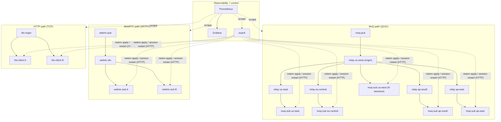
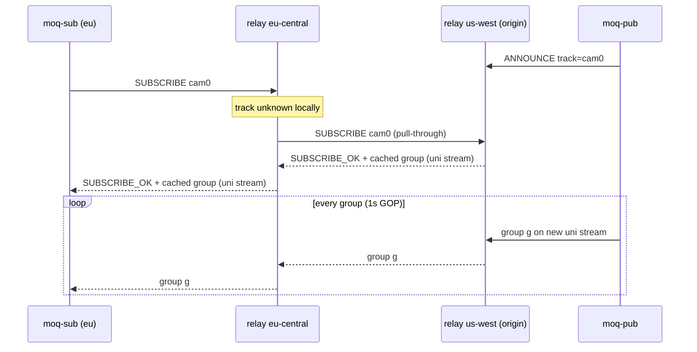
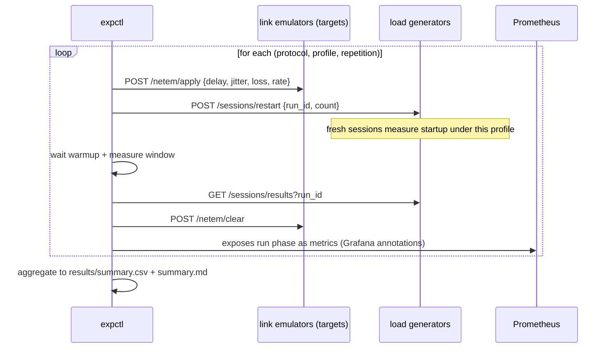

# 2. Architecture

## 2.1 One binary, many roles

Everything is a single Go binary (`edgecast`) selected by subcommand. Every role embeds the same admin server exposing `/metrics` (Prometheus), `/healthz`, and control endpoints. One image, one build, 20+ containers.

| Role | Subcommand | Purpose |
| --- | --- | --- |
| MoQ relay | `relay` | QUIC pub/sub relay; origin or edge (pull-through from upstream) |
| MoQ publisher | `moq-pub` | Publishes synthetic track to the origin relay, optional ABR |
| MoQ subscriber | `moq-sub` | Load generator: N concurrent subscribe sessions against a regional relay |
| WebRTC SFU | `webrtc-sfu` | Pion-based selective forwarding unit with HTTP signaling |
| WebRTC publisher | `webrtc-pub` | Publishes synthetic RTP track to the SFU |
| WebRTC subscriber | `webrtc-sub` | Load generator: N concurrent viewer PeerConnections |
| HLS origin | `hls-origin` | Live sliding-window playlist + segments, 3-rendition ladder |
| HLS client | `hls-client` | Load generator: N concurrent ABR player simulations |
| Experiment controller | `expctl` | Runs scenario matrix, drives netem agents, collects results |

## 2.2 Topology

Regions are simulated by shaping each edge relay's dial to the origin and each subscriber's dial to its regional relay (a base RTT models geographic distance, plus whatever the active scenario adds on the access side). Shaping happens in a userspace link emulator described in 2.6.

## 2.3 MoQ-style protocol (simplified)

Object model borrowed from moq-transport: a **track** is a named stream of **groups** (one group = one GOP, starts with a keyframe), a group is an ordered list of **objects** (frames).

Wire mapping:

- One bidirectional **control stream** per session. Control messages are length-prefixed JSON (`SETUP`, `ANNOUNCE`, `SUBSCRIBE`, `SUBSCRIBE_OK`, `PING`). Real MoQ uses varint-coded binary; JSON is deliberate here for debuggability in a testbed.
- Each **group rides its own QUIC unidirectional stream**. This is the property that matters: loss in group *n* cannot head-of-line-block group *n+1*, because they are independent streams. Objects are framed binary: header (track, group seq, object seq, publisher timestamp, keyframe flag, payload length) + payload.
- **Late join:** the relay caches the current group per track. A new subscriber immediately receives the cached group from its keyframe, then goes live. Startup does not wait for the next keyframe.
- **Relay tree:** an edge relay that receives a `SUBSCRIBE` for a track it does not carry subscribes upstream (pull-through), then fans out locally. Publisher uplink bytes are paid once per relay edge, not once per viewer.
- **Backpressure policy:** per-subscriber send queues drop **oldest whole groups** when full (configurable to newest-first for comparison). Dropping whole groups keeps every delivered group decodable from its keyframe.

## 2.4 Adaptive bitrate at the MoQ publisher

The publisher offers a fixed ladder (250 / 500 / 1000 / 2500 / 5000 kbps). Adaptation input is **transport backpressure**: the time it takes to flush each group into the QUIC stream. Sustained slow flushes (send window starved by congestion control) step the ladder down; sustained fast flushes step it up with hysteresis. This is deliberately simple and entirely observable in metrics (`edgecast_pub_tier`), so experiments can attribute stall reductions to it (RQ5).

## 2.5 WebRTC and HLS reference paths

- **WebRTC:** Pion. Publisher pushes a synthetic VP8-labeled RTP track at target bitrate to the SFU; the SFU fans packets out to each viewer PeerConnection. Custom HTTP offer/answer signaling. Default Pion interceptors (NACK retransmission, RTCP reports) are active; full GCC-style sender bandwidth estimation is not, which is recorded as a limitation.
- **HLS:** origin keeps a sliding window (6 x 2s segments) per rendition entirely in memory, plus a master playlist. Clients run a standard ABR loop: EWMA bandwidth estimate picks the rendition, buffer target 10s, startup when 2 segments are buffered, stall on buffer underrun.

## 2.6 Network emulation and experiment control

The original plan was kernel `tc netem`, but Docker Desktop's WSL2 kernel does not ship `sch_netem` (discovered by an early feasibility probe; see the stage-3 commit). The testbed therefore includes a **userspace link emulator** (`internal/netem`), which turned out to be a better fit for a reproducible testbed anyway: it runs identically on any Docker host, needs no kernel modules or NET_ADMIN, and its behavior is unit-testable Go.

How it works:

- An impairing `net.PacketConn` wraps each client-side UDP socket. Egress and ingress each pass through a **shaper**: token-bucket serialization at the rate cap with a bounded queue (tail-drop beyond 200ms of queueing, a bufferbloat guard), then propagation delay with uniform jitter applied per packet by a scheduler heap. Jittered packets can reorder, as with kernel netem. QUIC (quic-go) and WebRTC (Pion's ICE UDP mux) both accept a `net.PacketConn`, so the same emulator shapes both stacks.
- The scenario's `delay_ms` is the link's **added round-trip time**, split across the two directions; jitter, loss, and the rate cap apply to the downlink (media) direction, like shaping an access link.
- TCP (the HLS path) cannot be loss-impaired faithfully from userspace, since real loss acts below the congestion controller. The emulator applies a model instead: per-read serialization at the rate cap, propagation delay on direction changes, and loss expressed as retransmission-like pauses (2x RTT per lost MSS-equivalent). This is a documented approximation, not a simulation of TCP dynamics.
- Every process exposes `/netem/apply`, `/netem/clear`, `/netem/state` on its admin port, plus `edgecast_netem_*` gauges so dashboards always show the conditions in force.

`expctl` never touches Docker; it drives impairment and session lifecycle purely over HTTP on the compose network:

## 2.7 Observability

Prometheus scrapes every container every 5s. Grafana is provisioned from the repo with three dashboards: **Protocol Comparison** (startup/stall/throughput/jitter percentiles by protocol), **MoQ Relay Deep Dive** (fanout, cache hits, queue drops, per-region sessions), and **Experiments and Network** (active scenario, applied impairments, run timeline).

## 2.8 Divergences from real MoQ (honest list)

| This testbed | IETF moq-transport |
| --- | --- |
| JSON control messages | Varint binary control messages |
| Track namespace is a flat string | Namespace tuple + track name |
| One priority level | Publisher/subscriber priorities, group order preferences |
| Group cache depth = 1 group | Relay caching policy is an open design space |
| Raw QUIC only | Raw QUIC or WebTransport (browser reachable) |
| Self-signed TLS, no auth | Real deployments need auth on ANNOUNCE/SUBSCRIBE |
